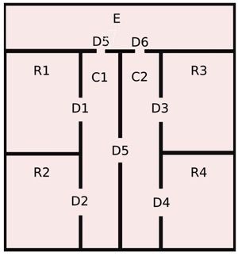
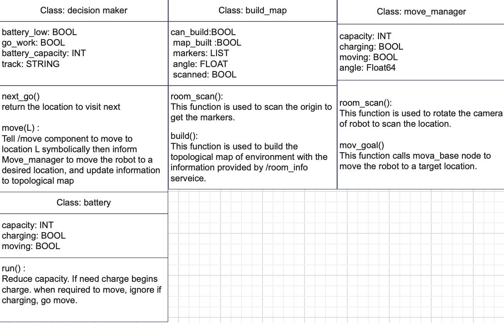
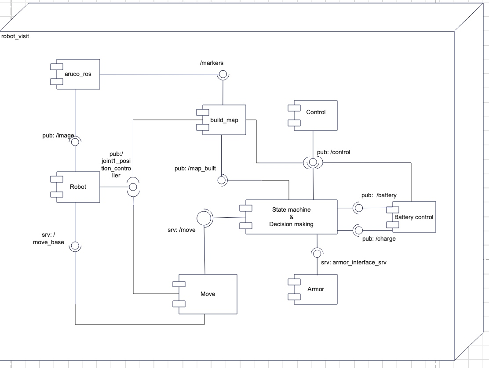
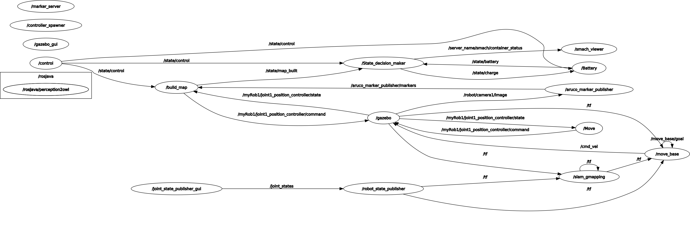
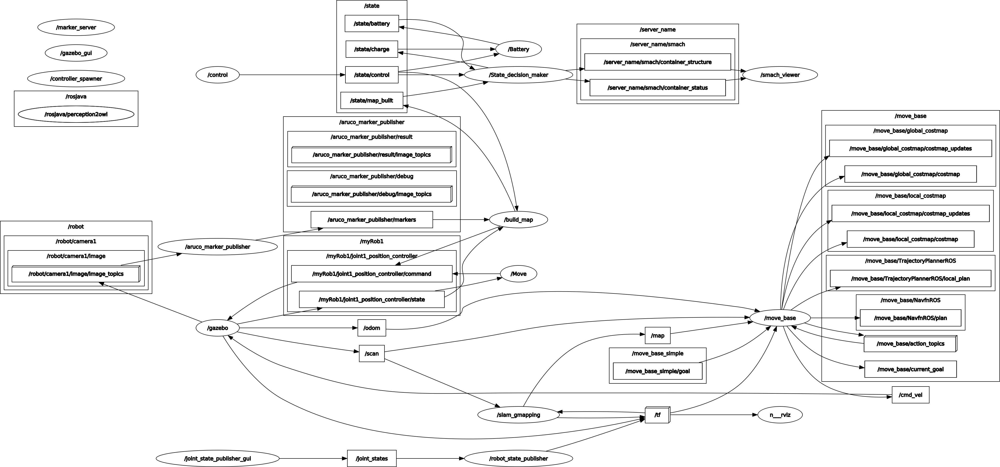

## author:
Zhouyang Hong
s5197402

## introduction:
This is the third assignment of the experimental robotics laboratory. The goal of this assignment is to achieve the autonomous navigation of a patrolling robot. The robot is able to automatically detect the markers and then construct a topological map then we use an additional library to enable the reasoning ability of the robot, and together with the state machine the robot autonomously navigates in the environment. 

Documentation can be found at here: https://qq765490023.github.io/ERL-Ass2-documentation/index.html

 

 
 
Relevant concepts include ontology, stage-machine, ROS, Topological-map, and autonomous navigation.

## Architecture

Above are the main classes for the implementation. Through next_go, the location the robot can go and also should go will be returned and strategies, batteries, control-state and ontology information are considered to make such a decision. Through move(L), robot will call the move to move to the target location, after arriving goal location, current location will be updated to ontology.

    Class decision-maker is for the symbolic control of the robot to deal with the topological map and represent the current state of the robot. 
    
    Build map is used to rotate to the camera of the robot and then scan the markers in the environment, furthermore to build the topological map then inform decision-maker.
    
    Move-manager is for controlling the movements of the robot when decision-maker decided where to go, here this class will call /move_base to move the robot to the desired location and then rotate the camera once to Scan the environment.
    
    Battery is for the simulation of a battery. This class publishes the current capacity to decision-makers. If the decision-maker thought the capacity is lower than a threshold then the decision-maker will navigate the robot to the area for charging. When being told to charge. Battery will simulate the charging function.

Above is the component diagram of this assignment. On the picture, there are the following modules.

    build_map:
    In build_map, the robot will rotate the camera, aruco_ros is subscribed to /image so that to recognize the markers. Then ask information from /room_infor to build topological map by interacting with Armor.
    
    aruco_ros:
    aruco_ros is a package for detecting the markers on boxes, then publish the result to /markers topic. 
    
    state-decision-maker:
    state-decision-maker consists of state-machine and decision-maker those 2 parts. Conceptually they are different, the decision-maker is used as a parameter for the state-machine. decision-maker can tell state-machine what decision to make for the next step, and also communicate with Move(which is to simulate the motion of robot), update topological locations. However, those are just functions provided, state-machine will decide whether and when to call them.
    
    control:
    Control the motion of the robot by simply inputting 'go' or 'stop'
    
    move:
    The robot will call move_base to navigate the robot to a desired location and then rotate once.
    
    armor:
    Armor is just a service ran used to support rospy to interact with Ontology, the code for doing such interaction is inside "state-decision-maker"
    
    battery control:
    This node is used for managing the battery, it will publish the current capacity of the battery to decision-maker to support decision-making. When the robot needs to charge and is in the right location, here is what that is responsible for charging.

Below are the rqt_graphs of the whole project(nodes).

Below is with topics.

## How to run
Firstly, make sure that you have all 4 packages in this project properly installed which include: Aruco_ros, robot_vist, assignment2, armor.
Then run those commands in different windows:

        roscore
        roslaunch assignment2 assignment.launch 
        rosrun smach_viewer smach_viewer.py 
        rosrun armor execute it.emarolab.armor.ARMORMainService
        roslaunch aruco_ros marker_publisher.launch 
        roslaunch assignment2 move_base.launch 
        roslaunch robot_visit robot_visit.launch
        rosrun robot_visit control.py

Once the ontology file is mounted in "robot_visit" window, type "go" in "control.py" window, Then the robot will begin autonomously do everything.

## Known issues:
    1.ARMORMainService needs to be restarted if robot_vist needs to be restarted.
    2. must send "stop" command in "control.py" window before we run "robot_visit" again.
    3. move_base must be launched after assignment.launch or the Gazebo will not be executed.
    4. Uncheck  "/image" when the robot begin to navigate, or Gazebo might crash due to the high cost of GPU resources.

## Result:
The following result is achieved and a video is provided and can be seen at here https://www.youtube.com/watch?v=YvU2GyUlNbU:
    1. Robot rotates on the original location and detects the makers on the boxes. 
    2. Aruco_ros subscribe to /image topic then publish the result to /makers topic.
    3. State-decision maker wait scan finish then begin to build the topological map.
    4. Once the map is built, the robot begins to visit corridors and rooms using state-machine and move_base package.
    5. Once arriving at a location, the robot rotates the camera to scan this place.

## Working hypothesis and environment:
#environment:
ubuntu 20.04, ROS-neotic, python 3.8.5,

## hypothesis
    1. Assuming that robot always starts with the same location that is surrounded by markers, because the robot need to detect markers and then build the topological map.
    2. Assuming that Aboxes and SWRL are provided in advance.
    
## features:

    1. Constantly visiting rooms while the nearest urgent rooms have the highest priority.  
    2. The robot tends to visit the room that it didn't visit for the longest time while under the condition that no room is urgent.
    3. Robot will go back to charge itself when the battery gets low, if E is not yet reachable, Robot tends to go to other corridors until E is reachable.
    4. Build a topological map autonomously 
    5. Camera is able to be controlled to rotate and scan the environment

## limtations:

    1.No markers on boxes:
        Aruco_ros successfully received the image from /image topic, and the image is seen in rviz and publishes the detection result to robot_vist. 
        The problem is that no markers on the boxes visually, so now I set  Aruco_ros directly publishes {11, 12, 13, 14, 15,16,17,}. While in real cases, the result shall not be complete inside one message, so the operation of getting the union of received results is considered.
    2. Robot moves too slowly and is related to the consumption of hardware resources 
    3. The body of the robot will rotate when rotating the camera caused by the reaction force
    4. state-machine updates with the topological map instead of the real map.
## Possible technical improvements
    
    1. In aruco_ros markers_publisher, modify the current provided message {11,12,13,14,15,16,17} into the result detected when markers are labeled on boxes.

    2. Rotation strategy. Now the robot just rotates left for a pi degree then rotates right another pi degree. rotate in a single direction and for 2 pi degrees will be better.
    
    3. A proper threshold for reckoning battery_low is not decided. If the remaining battery is able to reach the place to charge and better make full use of the battery are things to be considered. 

## Reference
    1. The first assignment: https://github.com/qq765490023/ERL-Ass1/tree/main/scripts
    2. The design of Aboxes is based on the following example. https://github.com/buoncubi/topological_map
    3. The design of the architecture referred to the following project: https://github.com/buoncubi/arch_skeleton
    4. The environment: https://github.com/CarmineD8/assignment2
    5. Ontology python interface. https://github.com/CarmineD8/armor_py_api
    6. Controlling the rotation of the camera: https://github.com/CarmineD8/m2wr_moveit
    7. The design of the robot: https://github.com/CarmineD8/robot_urdf
    8. The detection of markers: https://github.com/CarmineD8/aruco_ros
